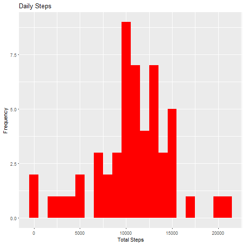
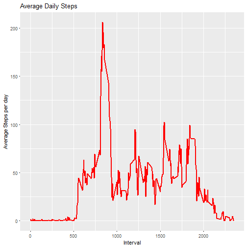
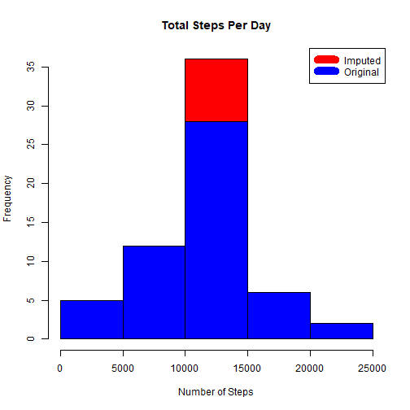
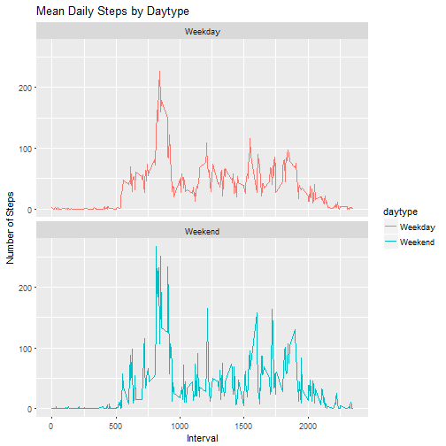

## Loading and preprocessing the data
Loading the data


```r
library(ggplot2)
activity <- read.csv("activity.csv")
```

Processing the data


```r
## Convert to date
activity$date <- as.Date(activity$date)  
```

## What is mean total number of steps taken per day?
1. Calculate the total number of steps taken per day:


```r
Totalperday <- aggregate(steps ~ date, activity, sum)
print(Totalperday)
```

```
##          date steps
## 1  2012-10-02   126
## 2  2012-10-03 11352
## 3  2012-10-04 12116
## 4  2012-10-05 13294
## 5  2012-10-06 15420
## 6  2012-10-07 11015
## 7  2012-10-09 12811
## 8  2012-10-10  9900
## 9  2012-10-11 10304
## 10 2012-10-12 17382
## 11 2012-10-13 12426
## 12 2012-10-14 15098
## 13 2012-10-15 10139
## 14 2012-10-16 15084
## 15 2012-10-17 13452
## 16 2012-10-18 10056
## 17 2012-10-19 11829
## 18 2012-10-20 10395
## 19 2012-10-21  8821
## 20 2012-10-22 13460
## 21 2012-10-23  8918
## 22 2012-10-24  8355
## 23 2012-10-25  2492
## 24 2012-10-26  6778
## 25 2012-10-27 10119
## 26 2012-10-28 11458
## 27 2012-10-29  5018
## 28 2012-10-30  9819
## 29 2012-10-31 15414
## 30 2012-11-02 10600
## 31 2012-11-03 10571
## 32 2012-11-05 10439
## 33 2012-11-06  8334
## 34 2012-11-07 12883
## 35 2012-11-08  3219
## 36 2012-11-11 12608
## 37 2012-11-12 10765
## 38 2012-11-13  7336
## 39 2012-11-15    41
## 40 2012-11-16  5441
## 41 2012-11-17 14339
## 42 2012-11-18 15110
## 43 2012-11-19  8841
## 44 2012-11-20  4472
## 45 2012-11-21 12787
## 46 2012-11-22 20427
## 47 2012-11-23 21194
## 48 2012-11-24 14478
## 49 2012-11-25 11834
## 50 2012-11-26 11162
## 51 2012-11-27 13646
## 52 2012-11-28 10183
## 53 2012-11-29  7047
```

2. Make a histogram of the total number of steps taken each day


```r
ggplot(Totalperday, aes(x = steps)) + 
      geom_histogram(fill = "red", binwidth = 1000) +
      labs(title = "Daily Steps", x = "Total Steps", y = "Frequency")
```



3. Calculate and report the mean and median of the total number of steps taken per day


```r
Mean_Steps <- mean(Totalperday$steps, na.rm = TRUE)
Median_Steps <- median(Totalperday$steps, na.rm = TRUE)
```
Thus, the mean of the total number of steps taken per day is 1.0766189 &times; 10<sup>4</sup>, and the median of the total number of steps taken per day is 10765.

## What is the average daily activity pattern?
1. Make a time series plot (i.e. type="l") of the 5-minute interval (x-axis) and the average number of steps taken, averaged across all days (y-axis).


```r
## Remove NA values from the dataset
activity_tidy <- activity[!is.na(activity$steps), ]

## Create average number of steps per interval
library(plyr)
Steps_Interval <- ddply(activity_tidy, .(interval), summarize, Avg = mean(steps))

## Create line plot of average number of steps per interval
p <- ggplot(Steps_Interval, aes(x = interval, y = Avg))
p + geom_line(color = "red", size = 1) + labs(title = "Average Daily Steps", x = "Interval", y = "Average Steps per day")
```



2. Which 5-minute interval, on average across all the days in the dataset, contains the maximum number of steps.


```r
max_interval <- Steps_Interval[which.max(Steps_Interval$Avg), 1]
```

The 835th interval contains the maximum average steps.

## Imputing missing values
1. Calculate and report the total number of missing values in the dataset (i.e. the total number of rows with NAs)


```r
totalNA <- sum(!complete.cases(activity))
```

There are 2304 number of rows containing missing values.

2.Impute missing values by filling the mean for that interval
3. Create a new dataset that is equal to the original dataset but with the missing data filled in.


```r
imputed_data <- transform(activity, steps = ifelse(is.na(activity$steps), Steps_Interval$Avg[match(activity$interval, Steps_Interval$interval)], activity$steps))
```

4. Make a histogram of the total number of steps taken per day and calculate the mean and median based on imputed dataset. Compare it with the original dataset.


```r
## Calculate and plot the imputed dataset and original dataset to show difference
Totalperday_i <- aggregate(steps ~ date, imputed_data, sum)
print(Totalperday_i)
```

```
##          date    steps
## 1  2012-10-01 10766.19
## 2  2012-10-02   126.00
## 3  2012-10-03 11352.00
## 4  2012-10-04 12116.00
## 5  2012-10-05 13294.00
## 6  2012-10-06 15420.00
## 7  2012-10-07 11015.00
## 8  2012-10-08 10766.19
## 9  2012-10-09 12811.00
## 10 2012-10-10  9900.00
## 11 2012-10-11 10304.00
## 12 2012-10-12 17382.00
## 13 2012-10-13 12426.00
## 14 2012-10-14 15098.00
## 15 2012-10-15 10139.00
## 16 2012-10-16 15084.00
## 17 2012-10-17 13452.00
## 18 2012-10-18 10056.00
## 19 2012-10-19 11829.00
## 20 2012-10-20 10395.00
## 21 2012-10-21  8821.00
## 22 2012-10-22 13460.00
## 23 2012-10-23  8918.00
## 24 2012-10-24  8355.00
## 25 2012-10-25  2492.00
## 26 2012-10-26  6778.00
## 27 2012-10-27 10119.00
## 28 2012-10-28 11458.00
## 29 2012-10-29  5018.00
## 30 2012-10-30  9819.00
## 31 2012-10-31 15414.00
## 32 2012-11-01 10766.19
## 33 2012-11-02 10600.00
## 34 2012-11-03 10571.00
## 35 2012-11-04 10766.19
## 36 2012-11-05 10439.00
## 37 2012-11-06  8334.00
## 38 2012-11-07 12883.00
## 39 2012-11-08  3219.00
## 40 2012-11-09 10766.19
## 41 2012-11-10 10766.19
## 42 2012-11-11 12608.00
## 43 2012-11-12 10765.00
## 44 2012-11-13  7336.00
## 45 2012-11-14 10766.19
## 46 2012-11-15    41.00
## 47 2012-11-16  5441.00
## 48 2012-11-17 14339.00
## 49 2012-11-18 15110.00
## 50 2012-11-19  8841.00
## 51 2012-11-20  4472.00
## 52 2012-11-21 12787.00
## 53 2012-11-22 20427.00
## 54 2012-11-23 21194.00
## 55 2012-11-24 14478.00
## 56 2012-11-25 11834.00
## 57 2012-11-26 11162.00
## 58 2012-11-27 13646.00
## 59 2012-11-28 10183.00
## 60 2012-11-29  7047.00
## 61 2012-11-30 10766.19
```

```r
hist(Totalperday_i$steps, main = paste("Total Steps Per Day"), col = "red", xlab = "Number of Steps", ylab = "Frequency")
hist(Totalperday$steps, col = "blue", add = TRUE)
legend("topright", c("Imputed", "Original"), col = c("red", "blue"), lwd = 10)
```



```r
## Calculate new mean and median for imputed dataset
Mean_Steps_i <- mean(Totalperday_i$steps)
Median_Steps_i <- median(Totalperday_i$steps)

## Calculate the difference
mean_diff <- Mean_Steps_i - Mean_Steps
median_diff <- Median_Steps_i - Median_Steps
total_diff <- sum(Totalperday_i$steps) - sum(Totalperday$steps)
```
- The mean from the imputed data is 1.0766189 &times; 10<sup>4</sup>.
- The median from the imputed data is 1.0766189 &times; 10<sup>4</sup>.
- The difference between the non-imputed mean and imputed    mean is 0.
- The difference between the non-imputed median and imputed median is 1.1886792.
- The difference between total number of steps between imputed and non-imputed data is 8.6129509 &times; 10<sup>4</sup>.

## Are there differences in activity patterns between weekdays and weekends?

1. Create a new factor variable in the dataset with two levels - "weekday" and "weekend" indicating whether a given data is a weekday or weekend day.


```r
## Create a new factor variable indicating weekday or weekend in imputed dataset
Weekdays <- c("Monday", "Tuesday", "Wednesday", "Thursday", "Friday")
imputed_data$daytype <- as.factor(ifelse(weekdays(Totalperday_i$date) %in% Weekdays, "Weekday", "Weekend"))
```

2. Make a panel plot containing a time series plot of the 5-minute interval (x-axis) and the average number of steps taken, averaged across all weekday days or weekend days (y-axis).


```r
Steps_Interval_i <- ddply(imputed_data, .(interval, daytype), summarize, Avg = mean(steps))

f <- ggplot(Steps_Interval_i, aes(x = interval, y = Avg, color = daytype)) + geom_line() + labs(title = "Mean Daily Steps by Daytype", x = "Interval", y = "Number of Steps") + facet_wrap(~daytype, ncol = 1, nrow = 2)
print(f)
```



Done


